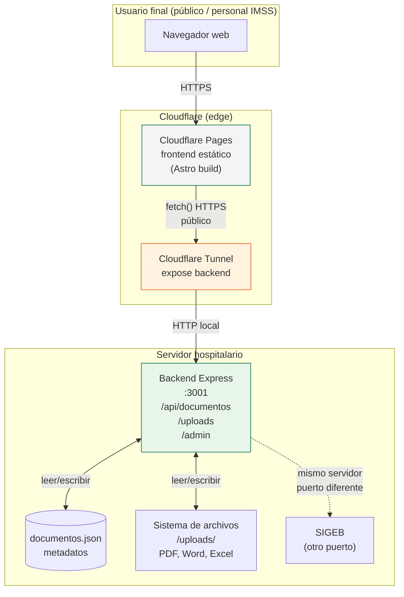
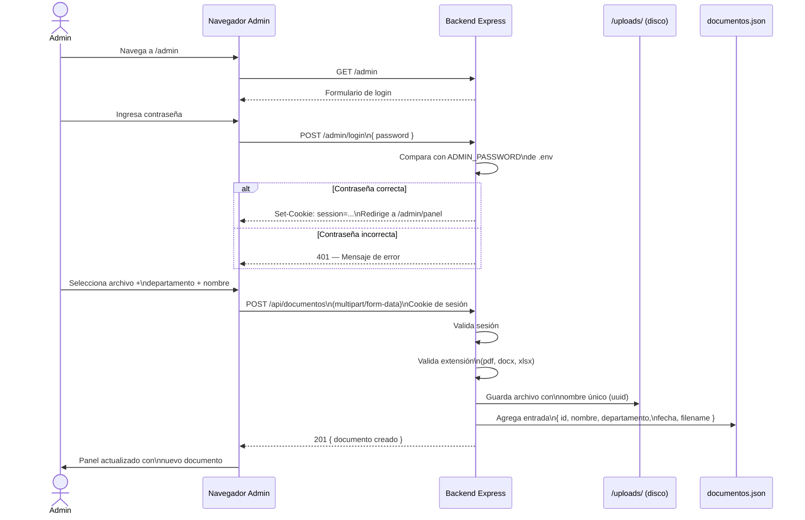
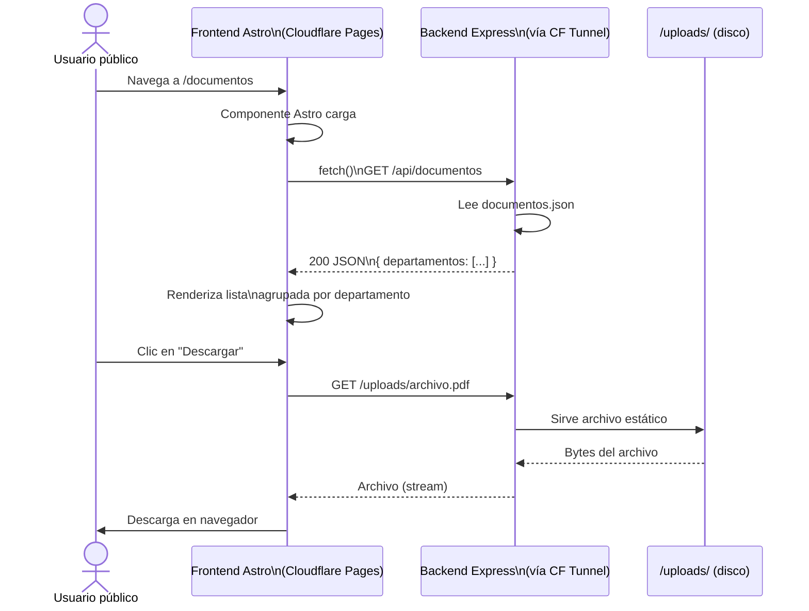
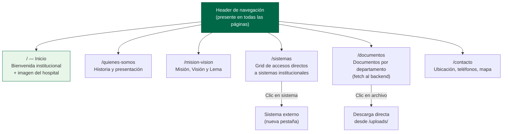
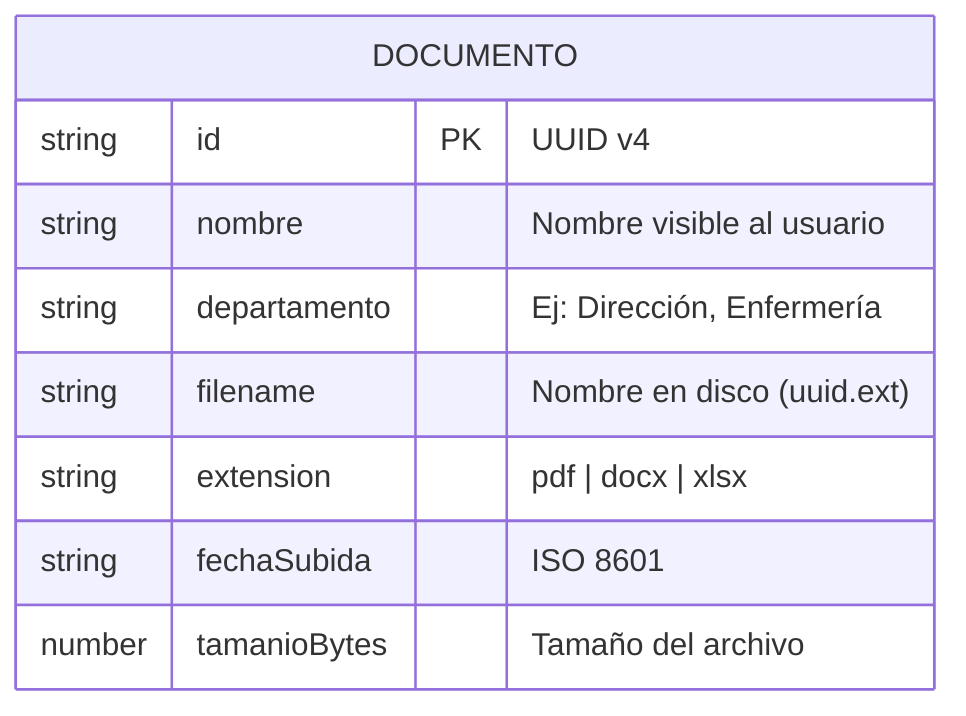
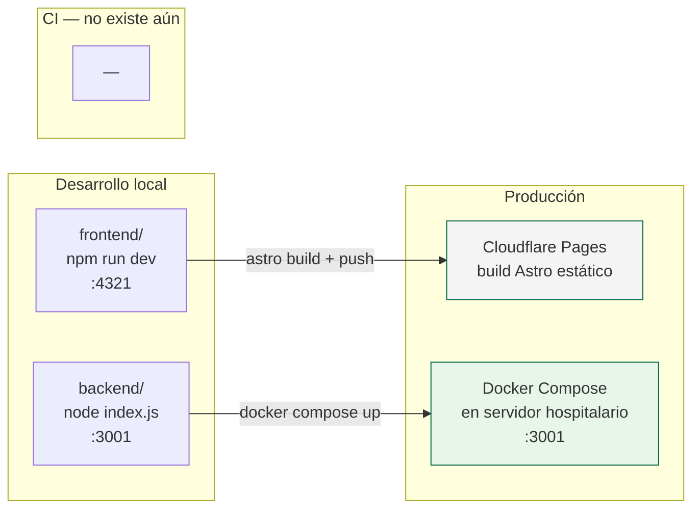

# MERMAID — Diagramas Portal UMAE

---

## 1. Arquitectura general del sistema

---

## 2. Flujo de subida de documentos (administrador)

---

## 3. Flujo de consulta de documentos (usuario público)

---

## 4. Navegación del portal público

---

## 5. Estructura de datos — documentos.json

---

## 6. Modelo de despliegue

